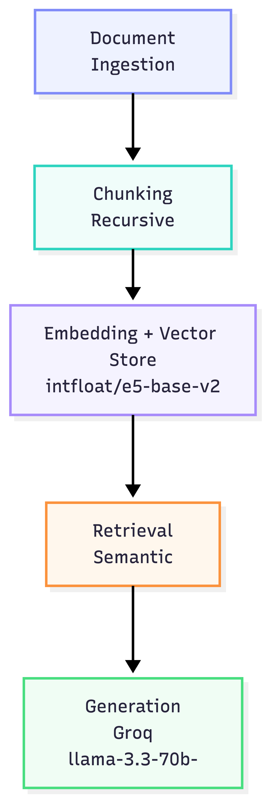

# Project 1 Planning: The Unofficial Guide

> Write this document before you write any pipeline code.
> Your spec and architecture diagram are what you'll use to direct AI tools (Claude, Copilot, etc.) to generate your implementation — the more specific they are, the more useful the generated code will be.
> Update the Retrieval Approach and Chunking Strategy sections if you change your approach during implementation.
> Update this file before starting any stretch features.

---

## Domain

<!-- What domain did you choose? Why is this knowledge valuable and hard to find through official channels? -->

My system covers University of California Irvine (UCI) Computer Science professor reviews. It is useful because it dives deeper into the inner workings of the courses such as difficulty, workload, and the teaching style of the professor from the perspective of the student. Also, it helps the student determine whether they want to enroll in a course with said professor.

---

## Documents

<!-- List your specific sources: URLs, subreddit names, forum threads, or file descriptions.
     Aim for at least 10 sources that together cover different subtopics or perspectives within your domain. -->

Sources are all from Rate My Professor where it collects student reviews based on the professor and course they were teaching.

- Hadar Ziv https://www.ratemyprofessors.com/professor/421976
- Michael Shindler https://www.ratemyprofessors.com/professor/2512998
- Raymond Klefstad https://www.ratemyprofessors.com/professor/17490
- Alexander Ihler https://www.ratemyprofessors.com/professor/1751393
- Kalev Kask https://www.ratemyprofessors.com/professor/2223956
- Vijay Vazirani https://www.ratemyprofessors.com/professor/2763913
- Jennifer Wong-Ma https://www.ratemyprofessors.com/professor/2409085
- Erik Sudderth https://www.ratemyprofessors.com/professor/2285930
- Scott Jordan https://www.ratemyprofessors.com/professor/240643
- Xiaohui Xie https://www.ratemyprofessors.com/professor/2127710

---

## Chunking Strategy

<!-- How will you split documents into chunks?
     State your chunk size (in tokens or characters), overlap size, and explain why those
     numbers fit the structure of your documents.
     A review-heavy corpus warrants different chunking than a long FAQ. -->

**Chunk size:**
The chunk size will be set to the largest review size which is 350 characters.

**Overlap:**
To accomodate for overlap, it will be roughly 100 characters so that no context is lost.

**Reasoning:**
The reasoning behind the chunk and the overlap size is because the max review that a user can give on Rate My Professor is 350 characters and the overlap is to prevent any context from being lost when the chunks meld together.

---

## Retrieval Approach

<!-- Which embedding model are you using (e.g., all-MiniLM-L6-v2 via sentence-transformers)?
     How many chunks will you retrieve per query (top-k)?
     If you were deploying this for real users and cost wasn't a constraint, what tradeoffs
     would you weigh in choosing a different embedding model — context length, multilingual
     support, accuracy on domain-specific text, latency? -->

**Embedding model:**
I have chosen intfloat/e5-base-v2 for the embedding model. Great open-source option, short text speciality, and strong on opinion/review-style text.

**Top-k:**
The top 4 chunks will do as that is the sweet spot for RMP and a professor may have few reviews. So allowing us to get those will create a good enough signal for them.

**Production tradeoff reflection:**
I'd keep it because the 512 token limit isn't a constraint for short reviews, local inference removes latency and cost, and the accuracy tradeoff vs. larger models doesn't justify the complexity for this scope.

---

## Evaluation Plan

<!-- List your 5 test questions with their expected correct answers.
     Questions should be specific enough that you can judge whether the system's response
     is right or wrong. "What are good dining halls?" is too vague.
     "What do students say about wait times at [dining hall name] during lunch?" is testable. -->

| #   | Question                                        | Expected answer                                              |
| --- | ----------------------------------------------- | ------------------------------------------------------------ |
| 1   | Which professor is the easiest?                 | Reviews will vary depending on the student                   |
| 2   | Which professor gives the most homework?        | Reviews will either say Raymond Klefstad or Jennifer Wong-Ma |
| 3   | Which professor has the best teaching style?    | Reviews with say either Michael Shindler or Jennifer Wong-Ma |
| 4   | Which professor at UCI is the most recommended? | Reviews will vary depending on the student                   |
| 5   | Does Professor Klefstad give weekly quizzes?    | Yes for all his courses                                      |

---

## Anticipated Challenges

<!-- What could go wrong? Name at least two specific risks with reasoning.
     Consider: noisy or inconsistent documents, missing source attribution, off-topic
     retrieval, chunks that split key information across boundaries. -->

1. The documents will not be accurate for the user and it will depend on getting accuracy from the reviewers.

2. Sparsity in reviews as some of the professors only have 3-5 reviews.

---

## Architecture

<!-- Draw a diagram of your pipeline showing the five stages:
     Document Ingestion → Chunking → Embedding + Vector Store → Retrieval → Generation
     Label each stage with the tool or library you're using.
     You can use ASCII art, a Mermaid diagram, or embed a sketch as an image.
     You'll use this diagram as context when prompting AI tools to implement each stage. -->

---

## AI Tool Plan

<!-- For each part of the pipeline below, describe:
     - Which AI tool you plan to use (Claude, Copilot, ChatGPT, etc.)
     - What you'll give it as input (which sections of this planning.md, which requirements)
     - What you expect it to produce
     - How you'll verify the output matches your spec

     "I'll use AI to help me code" is not a plan.
     "I'll give Claude my Chunking Strategy section and ask it to implement chunk_text()
     with my specified chunk size and overlap" is a plan. -->

We will begin by feeding the pipeline sources gathered from Rate My Professor, all of which are in URL form. These URLs will be fetched and converted into HTML, then cleaned and transformed into Markdown to ensure structured, noise-free text. The Markdown documents will then pass through recursive chunking, breaking them into appropriately sized segments before being embedded using `intfloat/e5-base-v2` and stored in a vector store. When a query is made, semantic retrieval will pull the most relevant chunks, which are then passed to Groq's `llama-3.3-70b` model for final answer generation.

**Milestone 3 — Ingestion and chunking:**

**Milestone 4 — Embedding and retrieval:**

**Milestone 5 — Generation and interface:**
